# Solie Change Logs

See old versions of Solie at a glance.

## Releases

### Version 8

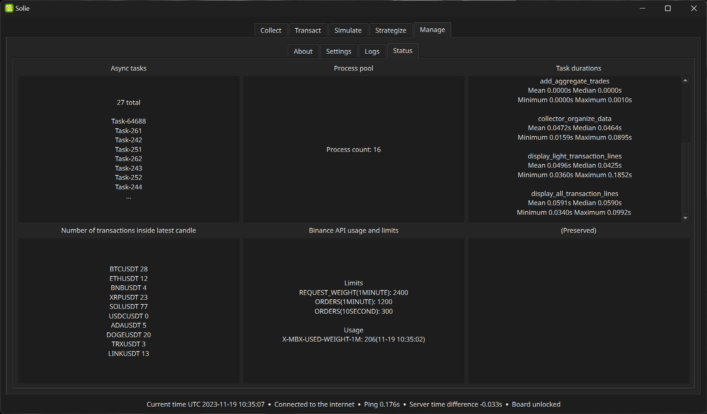

- Released on November 19, 2023
- Doesn't include many visual changes
- Various internal APIs and perfomance were improved
- Adopted async system for better concurrency
- Applied type safety to the entire codebase
- Switched to Poetry for dependency management

### Version 7

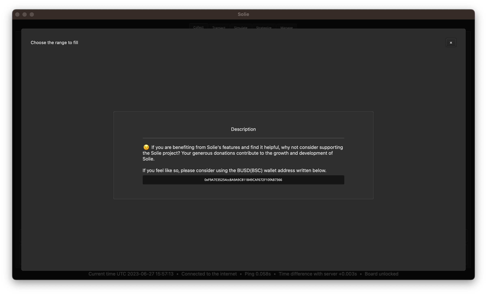

- Released on June 28, 2023
- Open-sourced
- Removed all fees

### Version 6

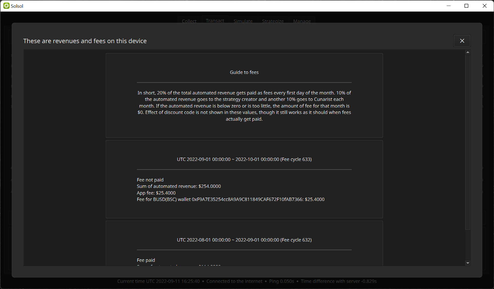
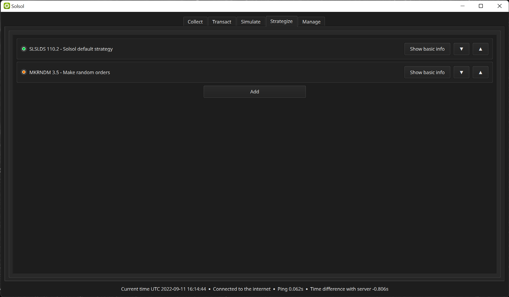

- Released on September 1, 2022
- Auto fee payment
- Multiple custom strategies and properties

### Version 5

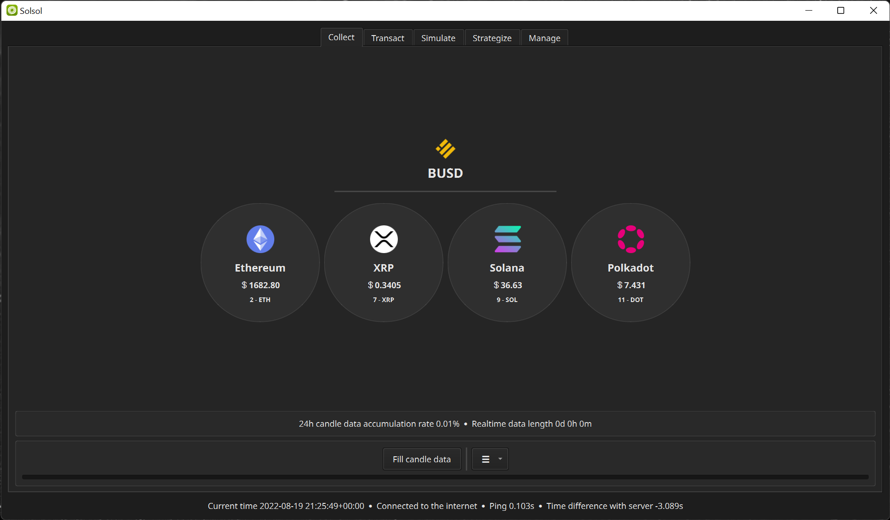

- Released on August 20, 2022
- New icon and version display is applied
- Changed to dark theme
- Overlap popup, a new UI element is implemented
- Now errors are displayed in the UI as much as possible
- Organized code in many areas
- React to Binance historical data format change

### Version 4

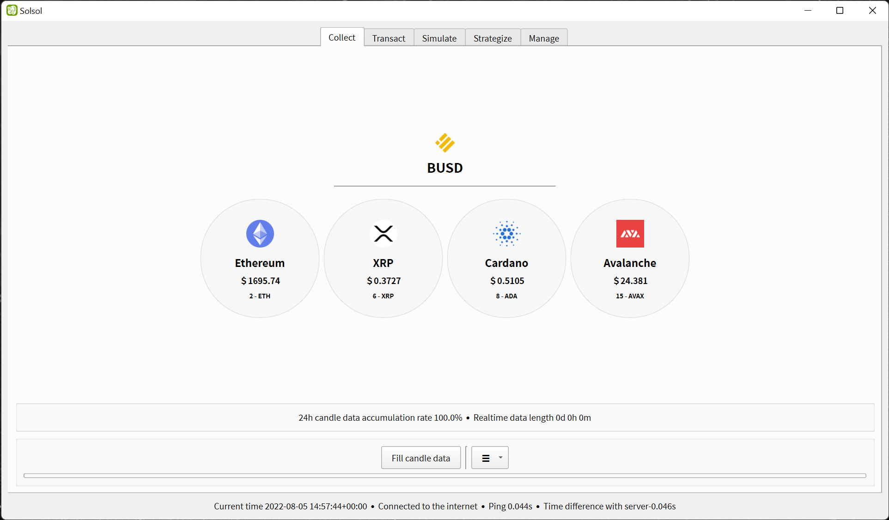

- Released on August 5, 2022
- Use and display only packages with a commercializable license
- Changed user interface language to English for public release
- Added asset token selection feature
- Removed high-speed strategy feature
- Improved internal performance and improved stability
- Only one basic strategy is provided

### Version 3

- Released on April 24, 2022
- Changed decision script to have its own loop statement
- Removed all code that depends on miniconda
- Changed to install all internal packages from scratch
- Made updaters to be prepared in advance

### Version 2

- Released on March 11, 2022
- Support for limit order feature
- Improved stability
- Board lock feature
- Use a dedicated widget for input in number format
- Improved user experience of installation and uninstallation procedures
- Internal stylesheet integration and improvements
- Modify the format of the information provided to the simulation

### Version 1

- Released on March 7, 2022
- High resolution DPI support
- Fixed an issue where parts of compiled code follow the old rules of Python 2
- Changed to use the correct conda channel
- Internal code cleanup

### Pre-release

- Released on 2022-02-26
- Changed log and comments to English
- Improved simulation stability
- Cleaned up by removing or restoring outdated strategies
- Improved performance by listening to only the necessary websocket signals
- Added button to open web user manual
- Applied license key
- Added brand text logo
- Applied log output to more places
- Provides installers and automatic updates for general users
- Added splash window
- Start giving version numbering

### Development Phase

2022-02-21

- Apply syntax highlighting to the script editor

2022-02-18

- Included user manual in the window
- Apply icons and widgets to more places

2022-02-17

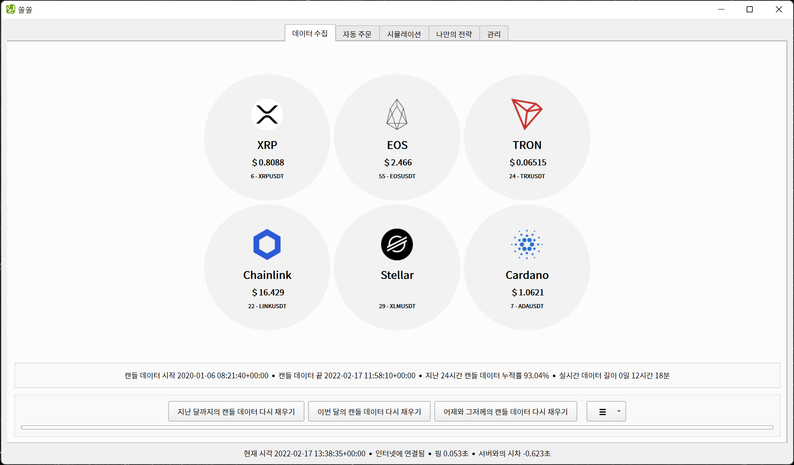

- Added a feature that allows users to select the desired coin
- Coin icon is also displayed to provide a better experience

2022-02-12

- Added Support for fast strategy with 0.1s interval using real-time data

2022-02-07

- Added real-time data collection feature using websocket

2022-01-17

- Switched to Binance API instead of web scraping for collecting data

2021-12-24

- Added status panel to see operation status at a glance

2021-12-22

- Added the ability to create your own strategy

2021-12-21

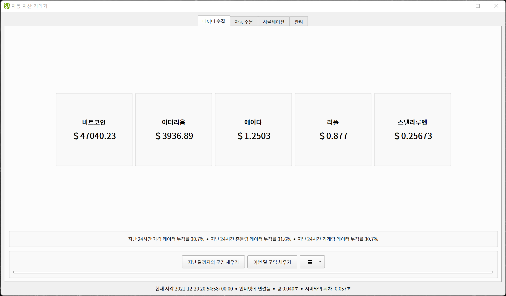

- Changed to light default theme for cross-platform compatibility

2021-11-22

- Added the ability to organize the output

2021-11-20

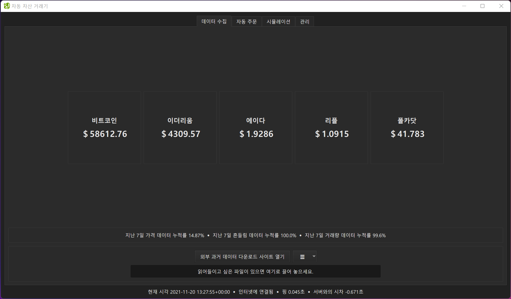
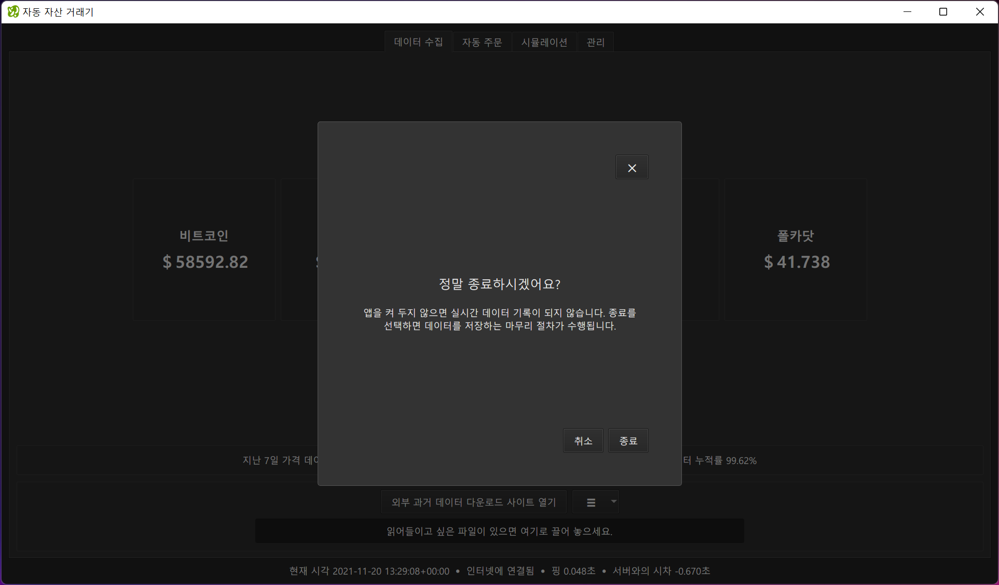

- Added confirmation popup
- Added ability to read historical CSV files

2021-11-16

- Added volume data collection feature

2021-11-12

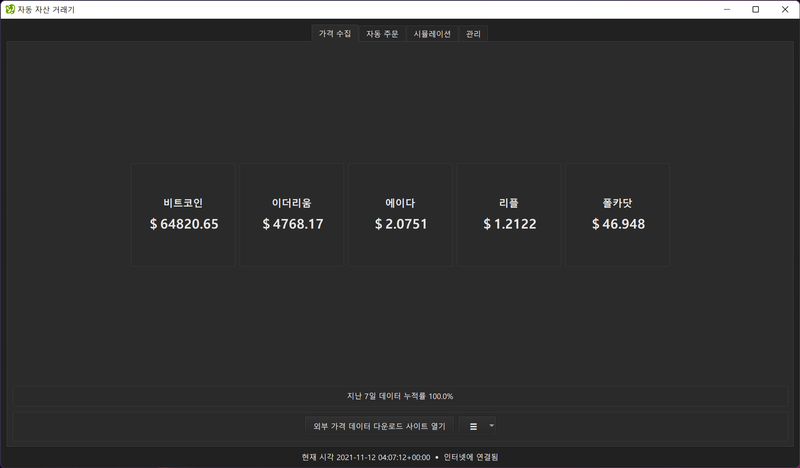

- Multi-coin support

2021-10-29

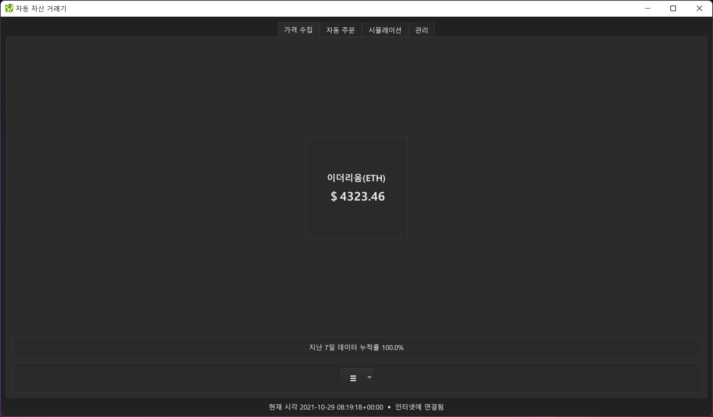

- Separated price collection algorithms from automatic orders

2021-10-14

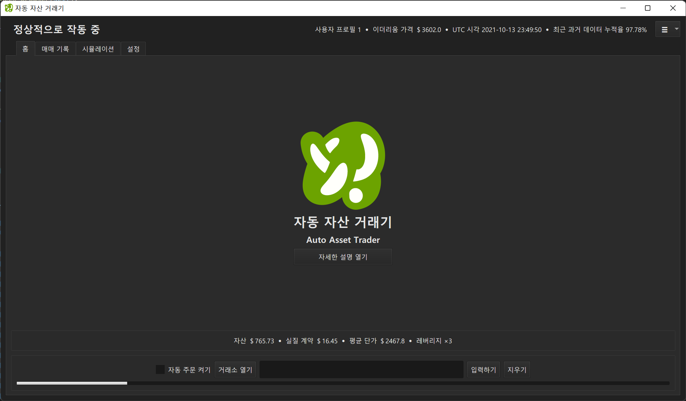

- Improved the first screen

2021-07-17

- Integrated web manipulation window

2021-06-22

- Improved graph navigation to be much faster and easier

2021-06-11

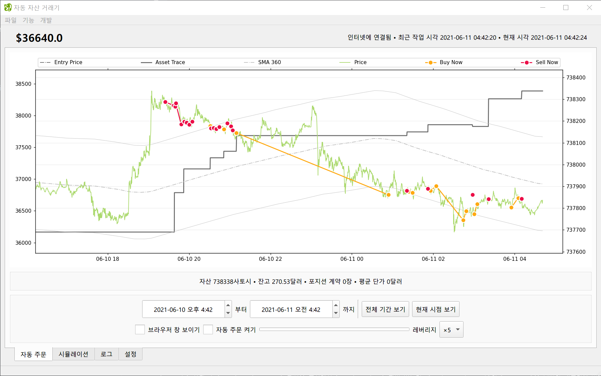

- Made Solie use a separate data storage folder
- Added user profile feature

2021-05-16

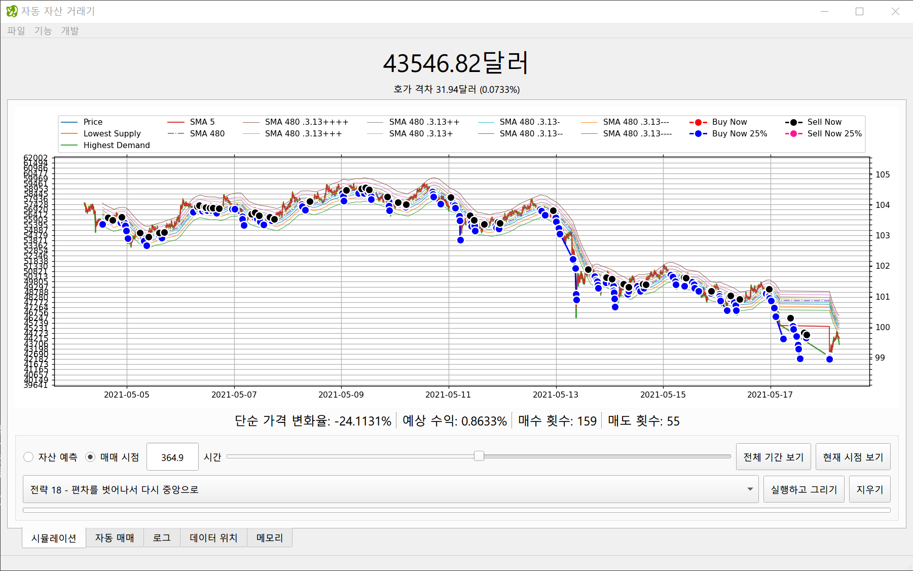

- Changed screen layout to show more information

2021-04-18

- Added Phemex automatic ordering feature through web operation

2021-02-28

- Added very basic simulation feature
- Added ability to choose strategy
