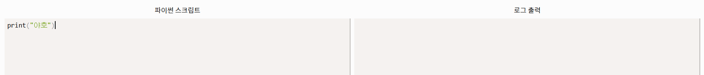
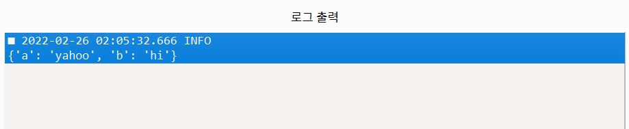
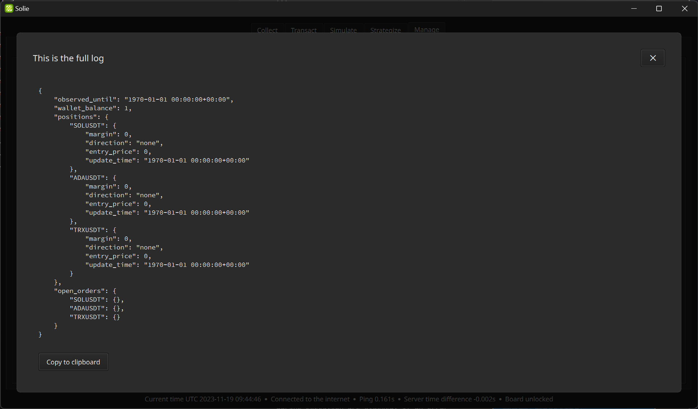

# Contribution Guide

Guides below will help you dive into the Solie codebase.

When using terminal commands from the following sections, always make sure that your current working directory is the root folder of the cloned repository.

## 🧮 Preparing the Repository

You need to install some components on your system first.

First, install [Python](https://www.python.org/). We recommend using the official Python installer provided from the website to ensure stability. Don't forget to add `python` command to PATH during the installation.

Then, make sure [Poetry](https://python-poetry.org/) is installed on your system.

```bash
pip install pipx
python -m pipx ensurepath
pipx install poetry
```

Install the dependencies. You only have to do this once.

```bash
poetry install
```

Activate the Poetry shell and run the code.

```bash
poetry shell
python -m solie
```

## 🧰 Debugging

If there is Python code that you want to run, you can run it in the `Logs` of the `Manage` tab. After writing the code in the `Python script` input field, you can press `Run script` button to get the result. The `print` function won't help you because it prints to the terminal rather than the log list.

Note that what you're running here is a real Python code. Therefore, you can import various modules including `solie` from the script.



To output something as a log, you can use the default `logger`. When you run this code, you will see a new record being added to the log list in the `debugger`. `logger` can show anything of any type.

```python
logger.debug("Something you want to know about")
```

You can also choose the importance of the log. There are 5 log levels: `DEBUG`, `INFO`, `WARNING`, `ERROR`, and `CRITICAL`. Our `logger` provided here will output all the levels.

```python
my_dictionary = {"a": "yahoo", "b": "hi"}
logger.info(my_dictionary)
```



You can also access workers. Direct modification of internal data is possible.

```python
from solie.worker import team

logger.debug(team.transactor.account_state)
```

If the type of the variable you want to output is `list` or `dict`, you can log it with better readability using the `json` standard library.

```python
import json

log_data = json.dumps(
    team.transactor.account_state,
    indent=2,
    default=str
)
logger.debug(log_data)
```



In the `Log output`, all logs that occur during execution are stacked. If an error occurs, it is also logged. If you're writing a strategy script and something doesn't work, visit here to figure out the cause.

## 🕹️ User Interface

The user interface can be modified by editing the `./craft/window.ui` file with `Qt Designer`. Run the designer app with the terminal command below.

```bash
poetry shell
pyside6-designer
```

After editing the UI file, you should compile it into a Python module.

```bash
pyside6-uic craft/window.ui -o package/solie/window/compiled.py
```

## 🚦 Rules

- Solie is written entirely in Python and utilizes Poetry as the primary tool for managing packages.
- Use the Ruff formatter for organizing code and identifying issues.
- Employ Pyright in basic mode for type checks. If you're using Visual Studio Code, Pylance extends Pyright’s capabilities.
- It should be user-friendly, allowing general users to navigate with just a few clicks.
- Development targets compatibility across Windows, Linux, and macOS without relying on platform-specific packages like `win32api`.
- UTC timezone information must be included in `datetime.datetime` objects. Also, include UTC timezone information wherever feasible, such as in `pandas.DatetimeIndex`.
