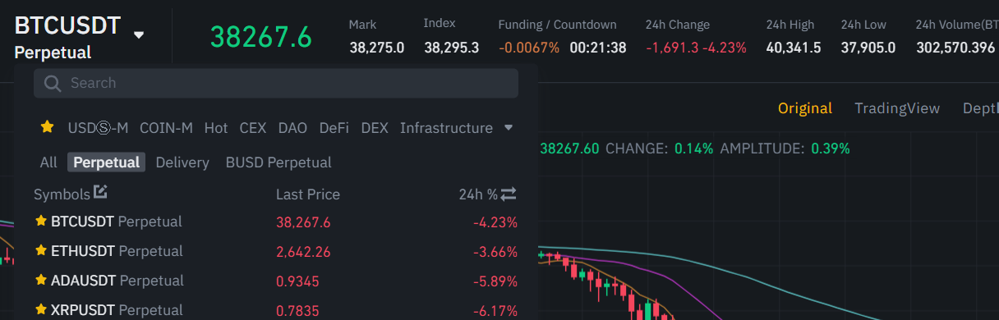
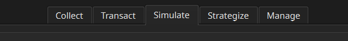
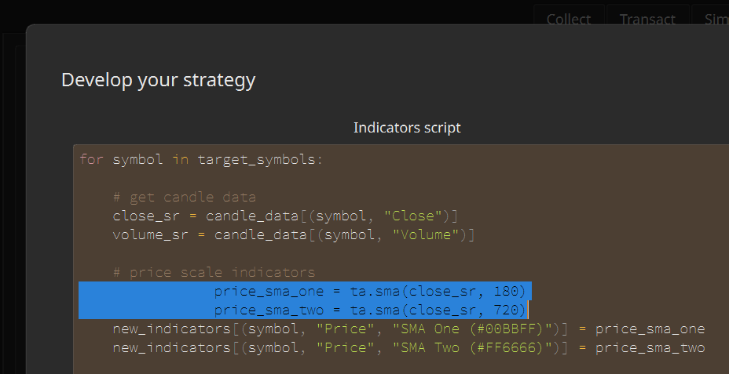
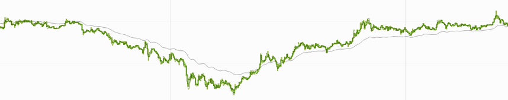
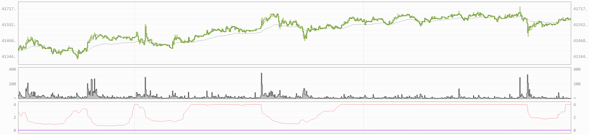
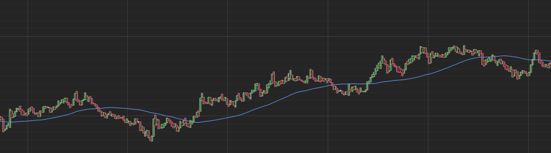
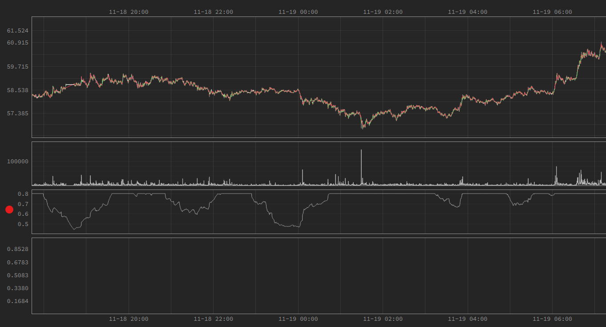
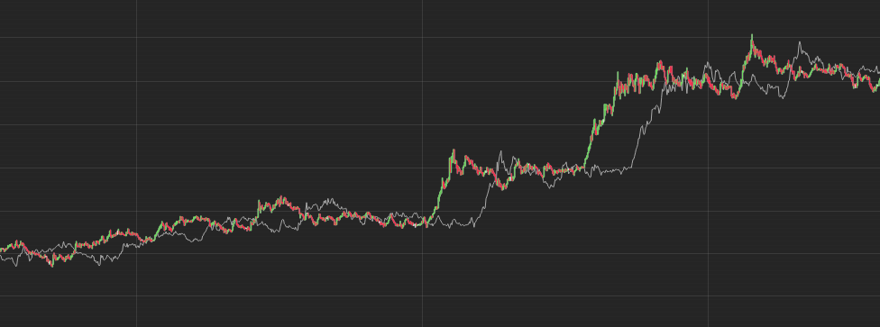

# How to Make Strategies

Python, known for its straightforward syntax and widespread popularity, is used for creating customized strategies.

## 📚 Basic Knowledge

`Symbol` refers to a market symbol that binds trading targets. A representative example is `BTCUSDT`.


### Creating Your Own Strategy

You can create your own strategy in the `Strategize` tab. Set strategy properties by clicking `Edit basic info` button.


### Script Editor

If writing a script from scratch is burdensome, it`s a good idea to start with a sample script.


You can indent or outdent multiple lines at once while writing a script. Select all the lines you want and press `Tab` or `Shift+Tab`.


If the script contains some broken code, a function that is executed periodically, such as graph update, repeatedly generates an error. In this case, the graph may not be updated or the simulation calculation may stop quickly. In that case, find out the cause in the `Logs` inside the `Manage` tab.

### Strategy's Basic Info

If parallel calculation is used, the entire period is cut by a certain length during simulation calculation, calculated separately, and then combined. This has the advantage of speeding up simulation calculations, but also has the disadvantage that it does not result in continuous asset calculations. For example, if you divide by 7 days, the asset and position status will return to the origin every 7 days.

In the internal calculation, the asset status is returned to the origin for each split length, but the final graph and result display show the corrected values ​​as if they were calculated continuously as if they were all added together. Since this calibration process refers to the input value of `Chunk division`, changing the `Chunk division` in the state that there is already calculated data may cause the graph and result display to be very strange.

It is recommended to set the `Chunk division` of parallel computation appropriately. Splitting by more than the number of child processes visible in the `Status` of the `Manage` tab does not contribute to the speedup. Be careful not to make the chunk division too short so that the asset's state doesn't change to origin too often.

Basic simulation calculations cover the entire year, which is a slow operation that takes minutes to tens of minutes. If you want to experiment with that strategy a little faster, try performing a temporary calculation on the visible range.


## 📊 Writing the Indicators Script

Indicators script is used to create indicators used for graph display and decision.

### API

Variables provided by default are as follows. You can use these without any import statements.

- `target_symbols`(`list[str]`): The symbols being observed.
- `candle_data`(`pandas.DataFrame`): Candle data. Extra 28 days of data before desired calculation range is included.
- `new_indicators`(`dict[tuple[str, str, str], pandas.Series]`): An object that holds newly created indicators.

### Basic Syntax

Candle data exists internally in the form of a tabular `pandas.DataFrame`.

```
                          MATICUSDT                        LTCUSDT
                          Close High  Low   Open  Volume   Close  High   Low    Open   Volume
2022-02-24 15:28:30+00:00 1.339 1.339 1.338 1.339 31966.0  96.98  96.99  96.85  96.93  669.532
2022-02-24 15:28:40+00:00 1.338 1.339 1.337 1.339 47233.0  96.89  97.00  96.85  96.99  395.509
2022-02-24 15:28:50+00:00 1.339 1.340 1.338 1.338 49107.0  96.97  96.99  96.88  96.89  803.709
2022-02-24 15:29:00+00:00 1.338 1.340 1.337 1.339 62917.0  96.85  97.00  96.85  96.96  541.428
2022-02-24 15:29:10+00:00 1.335 1.338 1.334 1.338 99874.0  96.71  96.88  96.71  96.86  797.188
2022-02-24 15:29:20+00:00 1.337 1.337 1.335 1.335 74435.0  96.83  96.85  96.71  96.71  174.285
2022-02-24 15:29:30+00:00 1.337 1.338 1.336 1.337 121574.0 96.81  96.86  96.81  96.84  110.111
2022-02-24 15:29:40+00:00 1.337 1.338 1.336 1.337 37174.0  96.88  96.91  96.80  96.81  795.653
2022-02-24 15:29:50+00:00 1.336 1.339 1.335 1.338 204744.0 96.75  96.94  96.71  96.87  1580.639
2022-02-24 15:30:00+00:00 1.334 1.336 1.334 1.336 104203.0 96.64  96.74  96.64  96.74  536.685
... ... ... ... ... ... ... ... ... ... ...
2022-02-26 01:27:40+00:00 1.571 1.572 1.571 1.572 3565.0   112.72 112.77 112.72 112.77 10.731
2022-02-26 01:27:50+00:00 1.572 1.572 1.571 1.571 45791.0  112.72 112.77 112.72 112.73 628.011
2022-02-26 01:28:00+00:00 1.572 1.572 1.572 1.572 1842.0   112.74 112.75 112.72 112.72 153.902
2022-02-26 01:28:10+00:00 1.572 1.572 1.572 1.572 2983.0   112.72 112.74 112.71 112.74 50.900
2022-02-26 01:28:20+00:00 1.572 1.572 1.571 1.572 2424.0   112.71 112.71 112.70 112.71 31.024
2022-02-26 01:28:30+00:00 1.573 1.573 1.572 1.572 4587.0   112.75 112.77 112.70 112.70 140.505
2022-02-26 01:28:40+00:00 1.574 1.574 1.573 1.573 36205.0  112.76 112.77 112.74 112.76 37.946
2022-02-26 01:28:50+00:00 1.574 1.574 1.574 1.574 2143.0   112.76 112.76 112.76 112.76 0.000
2022-02-26 01:29:00+00:00 1.574 1.574 1.574 1.574 6228.0   112.77 112.77 112.76 112.77 96.222
2022-02-26 01:29:10+00:00 1.572 1.573 1.572 1.573 3848.0   112.73 112.76 112.72 112.76 67.306
```

You can extract partial `pandas.Series` data from `candle_data`.

```python
import pandas as pd

for symbol in target_symbols:
    open_sr: pd.Series = candle_data[(symbol, "Open")]
    high_sr: pd.Series = candle_data[(symbol, "High")]
    low_sr: pd.Series = candle_data[(symbol, "Low")]
    close_sr: pd.Series = candle_data[(symbol, "Close")]
    volume_sr: pd.Series = candle_data[(symbol, "Volume")]
```

The `pandas.Series` object has the following form. A one-dimensional array containing values ​​over time.

```
2020-01-01 00:00:00+00:00 129.11
2020-01-01 00:00:10+00:00 129.03
2020-01-01 00:00:20+00:00 129.03
2020-01-01 00:00:30+00:00 128.94
2020-01-01 00:00:40+00:00 128.91
2020-01-01 00:00:50+00:00 128.97
2020-01-01 00:00:00+00:00 128.98
2020-01-01 00:01:10+00:00 129.03
2020-01-01 00:01:20+00:00 129.04
2020-01-01 00:01:30+00:00 129.01
...
2022-02-20 10:41:20+00:00 2633.99
2022-02-20 10:41:30+00:00 2633.07
2022-02-20 10:41:40+00:00 2633.43
2022-02-20 10:41:50+00:00 2633.04
2022-02-20 10:42:00+00:00 2633.24
2022-02-20 10:42:10+00:00 2632.45
2022-02-20 10:42:20+00:00 2630.84
2022-02-20 10:42:30+00:00 2631.55
2022-02-20 10:42:40+00:00 2630.69
```

Solie uses the `pandas-ta` package. Creation of dozens of basic indicators is available with this, including moving average, bollinger band, double exponential moving average, triple exponential moving average, stochastic, and parabolic. For more information, check the official documentation of `pandas-ta`[🔗](https://github.com/twopirllc/pandas-ta).

```python
import pandas_ta as ta

for symbol in target_symbols:
    close_sr = candle_data[(symbol, "Close")]
    sma_sr: pd.Series = ta.sma(close_sr, 60)
    # 60 candles represent 600 seconds(10 minutes)
```

Once you have created the indicators, simply put them in a `dict` object called `new_indicators` as appropriate tuple keys. After that, multiple `pandas.Series` objects inside this object are merged into a single indicators object. After writing this and saving it, you will see the indicator in the graph view. It can also be used in strategic decisions.

```python
import pandas_ta as ta

for symbol in target_symbols:
    close_sr = candle_data[(symbol, "Close")]
    sma_sr = ta.sma(close_sr, 60)
    # Here, the tuple key is `(symbol, "PRICE", "SMA")`
    new_indicators[(symbol, "PRICE", "SMA")] = sma_sr
```



The tuple key has 3 values. The first value represents a symbol and the third value would be any name you want. The second value determines which scale graph to draw on. It should be one of `PRICE`, `VOLUME`, or `ABSTRACT`.

- Graph 1: `PRICE` indicators
- Graph 2: `VOLUME` indcators
- Graph 3: `ABSTRACT` indicators
- Graph 4: Only asset information



> Taking the `BTCUSDT` symbol as an example, prices move in tens of thousands of dollars, volume moves in tens, and abstract indicators move in single digit units. Of course, you can't show these three different scales in one graph. That's why we let you choose the graph to be drawn with the second value of the tuple key.

You can set the color drawn on the graph as you wish. Just put parentheses next to the name and color code it. Color codes can be chosen on a color combination site[🔗](https://htmlcolorcodes.com/).

```python
import pandas_ta as ta

for symbol in target_symbols:
    close_sr = candle_data[(symbol, "Close")]
    sma_sr = ta.sma(close_sr, 60)
    new_indicators[(symbol, "PRICE", "SMA (#649CFF)")] = sma_sr  # Blue
```


Up to this point, indicators generation has been completed using the `pandas.Series` object and the `ta` module. However, the flexibility of the way metrics are generated by means of coding comes from now on. The `pandas.Series` object can be manipulated in a variety of ways, including addition, subtraction, division, and conditional transformations. The `pandas` official documentation[🔗](https://pandas.pydata.org/docs/) has a more detailed explanation.

Below is the code that creates the average of two different moving averages.

```python
import pandas_ta as ta

for symbol in target_symbols:
    close_sr = candle_data[(symbol, "Close")]
    sma_one = ta.sma(close_sr, 60)
    sma_two = ta.sma(close_sr, 360)

    average_sma = (sma_one + sma_two) / 2
    new_indicators[(symbol, "PRICE", "Average SMA")] = average_sma
```

Below is the code that creates a market overheating indicator with two different moving averages and limits the value to not exceed 0.8. In the picture, you can see that everything above 0.8 is cut off.

```python
import pandas_ta as ta

for symbol in target_symbols:
    volume_sr = candle_data[(symbol, "VOLUME")]
    sma_one = ta.sma(volume_sr, 360)
    sma_two = ta.sma(volume_sr, 2160)

    wildness = sma_one / sma_two  # Division operation
    wildness[wildness > 0.8] = 0.8  # Set the limit
    new_indicators[(symbol, "ABSTRACT", "Wildness")] = wildness
```



Below is the code that simply creates an indicator that delays the closing price by 10 minutes.

```python
for symbol in target_symbols:
    close_sr = candle_data[(symbol, "Close")]
    shifted_sr = close_sr.shift(60) # `pandas.Series` method
    new_indicators[(symbol, "PRICE", "Shifted")] = shifted_sr
```

 As demonstrated, many variations are possible for indicators generation through coding.

## ⚖️ Writing the Decision Script

The decision script is executed repeatedly every 10 seconds, which is the time length of a single candle. It is used to determine whether to place an order or, if so, which order to place.

### API

Variables provided by default are as follows. You can use these without any import statements.

- `target_symbols`(`list[str]`): The symbols being observed.
- `current_moment`(`datetime.datetime`): The current time rounded down to the base time. For example, if the current exact time is 14:03:22.335 on January 3, 2022, then `current_moment` appears as 14:03:20 on January 3, 2022 in the 10-second interval.

- `current_candle_data`(`dict[tuple[str, str], float]`): Only the most recent row is truncated from the observation data recorded up to the current time. Contains price and volume information from the market.

- `current_indicators`(`dict[tuple[str, str, str], float]`): Only the most recent row up to the current time is provided. It contains different indicator information depending on the indicators script.

- `account_state`(`AccountState`): Contains current account status information. An object for reading. Writing something inside has no effect.

- `scribbles`(`dict[Any, Any]`): Free writing space where you can write anything. After making a strategic decision, you can put whatever you want to remember inside this object.

- `decisions`(`dict[str, dict[OrderType, Decision]]`): This is the core object that contains the strategic judgment.

### Basic Syntax

You can extract a `Series` column from the candle `DataFrame` like this.

```python
open_price = current_candle_data[str(("BTCUSDT", "Open"))]
high_price = current_candle_data[str(("BTCUSDT", "High"))]
low_price = current_candle_data[str(("BTCUSDT", "Low"))]
close_price = current_candle_data[str(("BTCUSDT", "Close"))]
sum_volume = current_candle_data[str(("BTCUSDT", "Volume"))]
```

`AccountState` object provided by the API has a structure like below.

```python
class OrderType(Enum):
    NOW_BUY = 0
    NOW_SELL = 1
    NOW_CLOSE = 2
    CANCEL_ALL = 3
    BOOK_BUY = 4
    BOOK_SELL = 5
    LATER_UP_BUY = 6
    LATER_UP_SELL = 7
    LATER_UP_CLOSE = 8
    LATER_DOWN_BUY = 9
    LATER_DOWN_SELL = 10
    LATER_DOWN_CLOSE = 11
    OTHER = 12


class OpenOrder:
    order_type: OrderType
    boundary: float
    left_margin: float | None


class Position:
    margin: float
    direction: PositionDirection
    entry_price: float
    update_time: datetime


class AccountState:
    observed_until: datetime
    wallet_balance: float
    positions: dict[str, Position]
    open_orders: dict[str, dict[int, OpenOrder]]
```

`scribbles` are saved as `pickle` files. So it can hold almost any type of Python objects.

```python
# When adding a data, simply assign it.
scribbles["did_i_do_something"] = True
```

```python
# When retrieving, it is recommended to use the `get` method of `dict` in case it is not already stored.
did_i_do_it_before = scribbles.get("did_i_do_something", False)
```

You can check the indicator's current value with stringified tuple key.

```python
# Creating an indicator named SMA in the Price category with the indicators script
sma_value = current_indicators[str(("BTCUSDT", "PRICE", "SMA"))]
```

### Decision Types

There are 12 possible order commands, each corresponding to a specific order type on Binance. Simplified commands for easy and intuitive strategy development are used equally for automatic transaction and simulation.

Order type `CANCEL_ALL` cancels all open orders of the symbol market.

```python
from solie.utility import Decision, OrderType
decisions[symbol][OrderType.CANCEL_ALL] = Decision()
```

Order type `NOW_CLOSE` closes the position immediately. Corresponds to `Market Buy` or `Market Sell` orders on Binance with the maximum quantity and `Reduce Only`.

```python
from solie.utility import Decision, OrderType
decisions[symbol][OrderType.NOW_CLOSE] = Decision()
```

Order type `NOW_BUY` buys directly at market price. Corresponds to Binance order `Market Buy`.

```python
from solie.utility import Decision, OrderType
wallet_balance = account_state.wallet_balance
decisions[symbol][OrderType.NOW_BUY] = Decision(
    margin=wallet_balance * 0.08,
)
```

Order type `NOW_SELL` sells directly at market price. Corresponds to Binance order `Market Sell`.

```python
from solie.utility import Decision, OrderType
wallet_balance = account_state.wallet_balance
decisions[symbol][OrderType.NOW_SELL] = Decision(
    margin=wallet_balance * 0.08,
)
```

Order type `LATER_UP_CLOSE` puts an order that will close the position when the price goes up to that boundary. Corresponds to Binance order `Stop Market Buy` or `Take Profit Market Sell` with `Close Position` enabled.

```python
from solie.utility import Decision, OrderType
current_price = current_candle_data[str((symbol, "Close"))]
decisions[symbol][OrderType.LATER_UP_CLOSE] = Decision(
    boundary=current_price * 1.05,
)
```

Order type `LATER_DOWN_CLOSE` puts an order that will close the position when the price goes down to that boundary. Corresponds to Binance order `Stop Market Sell` or `Take Profit Market Buy` with `Close Position` enabled.

```python
from solie.utility import Decision, OrderType
current_price = current_candle_data[str((symbol, "Close"))]
decisions[symbol][OrderType.LATER_DOWN_CLOSE] = Decision(
    boundary=current_price * 0.95,
)
```

Order type `LATER_UP_BUY` puts an order to buy when the price goes up to that boundary. Corresponds to Binance order `Stop Market Buy`.

```python
from solie.utility import Decision, OrderType
current_price = current_candle_data[str((symbol, "Close"))]
wallet_balance = account_state.wallet_balance
decisions[symbol][OrderType.LATER_UP_BUY] = Decision(
    boundary=current_price * 1.05,
    margin=wallet_balance * 0.08,
)
```

Order type `LATER_DOWN_BUY` puts an order to buy when the price goes down to that boundary. Corresponds to Binance order `Take Profit Market Buy`.

```python
from solie.utility import Decision, OrderType
current_price = current_candle_data[str((symbol, "Close"))]
wallet_balance = account_state.wallet_balance
decisions[symbol][OrderType.LATER_DOWN_BUY] = Decision(
    boundary=current_price * 0.95,
    margin=wallet_balance * 0.08,
)
```

Order type `LATER_UP_SELL` puts an order to buy sell when the price goes up to that boundary. Corresponds to Binance order `Take Profit Market Sell`.

```python
from solie.utility import Decision, OrderType
current_price = current_candle_data[str((symbol, "Close"))]
wallet_balance = account_state.wallet_balance
decisions[symbol][OrderType.LATER_UP_SELL] = Decision(
    boundary=current_price * 1.05,
    margin=wallet_balance * 0.08,
)
```

Order type `LATER_DOWN_SELL` puts an order to sell when the price goes down to that boundary.Corresponds to Binance order `Stop Market Sell`.

```python
from solie.utility import Decision, OrderType
current_price = current_candle_data[str((symbol, "Close"))]
wallet_balance = account_state.wallet_balance
decisions[symbol][OrderType.LATER_DOWN_SELL] = Decision(
    boundary=current_price * 0.95,
    margin=wallet_balance * 0.08,
)
```

Order type `BOOK_BUY` puts a limit buy order that is added to the order book. Corresponds to Binance order `Limit Buy`.

```python
from solie.utility import Decision, OrderType
current_price = current_candle_data[str((symbol, "Close"))]
wallet_balance = account_state.wallet_balance
decisions[symbol][OrderType.BOOK_BUY] = Decision(
    boundary=current_price * 0.95,
    margin=wallet_balance * 0.08,
)
```

Order type `BOOK_SELL` puts a limit sell order that is added to the order book. Corresponds to Binance order `Limit Sell`.

```python
current_price = current_candle_data[str((symbol, "Close"))]
wallet_balance = account_state.wallet_balance
decisions[symbol][OrderType.BOOK_SELL] = Decision(
    boundary=current_price * 1.05,
    margin=wallet_balance * 0.08,
)
```

> In automatic ordering and simulation, all prices are based on `Last Price`. `Mark Price` is not used in the calculation.

### Side Note

Binance has a minimum order amount. As of February 2022, it is $5. In addition, the decimal precision of the quantity that can be ordered for each symbol is fixed. Therefore, in the actual automatic order, the order is sent with the quantity slightly rounded up from the `margin` determined by the decision. Because of this rounding, the actual amount being orders can have a significant amount of numerical error. Always check your position status before making an order in the decision script.

Open orders are limited to only one per type. During an actual automatic order, even if multiple open orders of the same type are stacked, all but the most recent one will be lost. This is Solie's own rules for a convenient decision system. For example, there cannot be more than one open order classified as `LATER_UP_BUY` at the same time. However, it is possible to have different kinds of commands open simultaneously. An open spell with `LATER_UP_BUY` and an open spell with `LATER_UP_SELL` can exist at the same time.

Even with the same `margin`, the actual amount value will vary depending on the leverage. For example, putting in a margin of $5 at 4x leverage means you are investing $20 in real money. Since leverage is the concept of borrowing and investing, the amount invested in my assets is less than the actual investment amount by the leverage multiplier.
