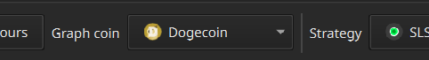
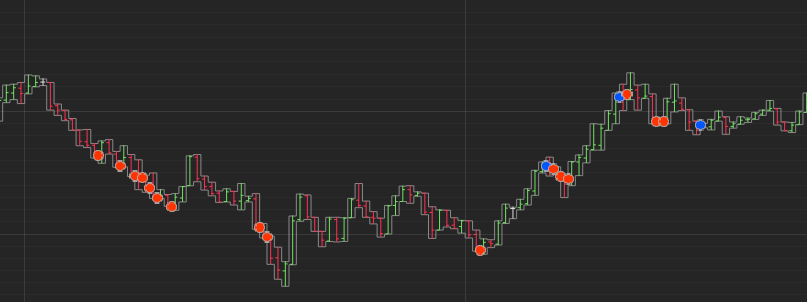
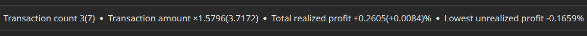
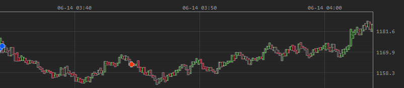
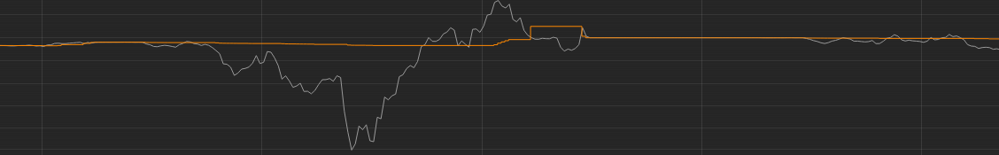
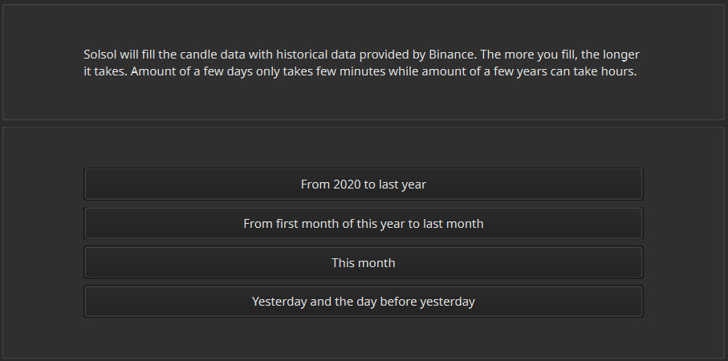
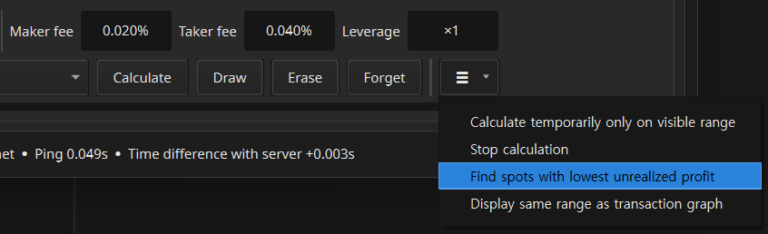
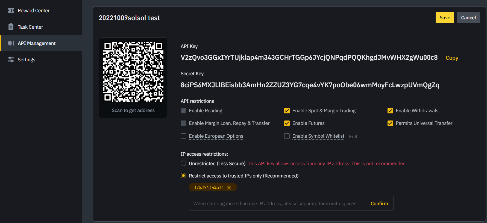
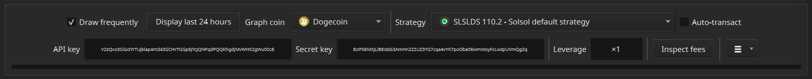

# Basic User Interface

## 📈 How to Read Graph and Range Information

Only one coin can be displayed at a time. In the lower panel you can choose a coin that Solie should draw.

The red dot is where you bought, and the blue dot is where you sold.

When viewing the range information at the top of the graph, two types of information are provided. The one inside parenthesis is the combined contribution of all target coins, and the one outside the parenthesis is the contribution of only the currently displayed coin.

In the price graph and asset graph, each major grid represents 1% and each minor grid represents 0.1%.

In the asset graph, the orange line is the realized asset, and the gray line is the asset that even reflects unrealized profit. The gray line is the asset you are holding at the current price of the position you are holding. In the picture below, you can see the orange line sticking to the gray line as soon as you close the position.

Only the returns of the actually executed trades are reflected in the "Total realized profit". Other asset changes such as deposits and withdrawals are not reflected in this value. Trading fees on Binance are reflected.

> Even if it is not an automatic order, if you buy and sell directly, the profit from the purchase is also reflected in this value.

## 🎯 How to Choose a Strategy and Leverage

It is recommended to check the return and risk of the strategy and leverage you want to choose through simulation before the actual automatic ordering.

To get meaningful results, you need to perform simulation calculations with enough candle data. In the "Collect" tab, you can fill the historical candle data.

After the simulation calculation, you can find the points with the lowest unrealized returns. Experiment with varying simulation leverage. You can see when you were closest to a forced liquidation and how dangerous it was. As soon as it approaches -100%, A forced liquidation is made from Binance.

> You do not need to recalculate every time you change the simulation leverage. Just enter the desired number and it will be updated shortly on the graph based on the already

## 🛒 How to Order Automatically

Sign in at the Binance [account page](https://accounts.binance.com/).

Open futures account following the official instructions[🔗](https://www.binance.com/en/support/faq/360033772992).

> You must first open futures account before proceeding to the next step. The option "Enable Futures" does not exist for API keys generated before opening futures account.

On the key issue page[🔗](https://www.binance.com/en/my/settings/api-management), click the "Create API" button to get a key issued.

> The secret key is only visible immediately after creation. If you go back later, it will be hidden so that no one can see it. Make a copy of that key right away.

Check "Enable Futures" in the key edit page.

Open "Transact" tab in Solie and enter the two issued keys in Solie. Doing so will receive and record your Binance account information.

Deposit in the form of you choose, such as `USDT` or `BUSD` to Binance futures wallet as per the official instructions[🔗](https://www.binance.com/en/support/faq/360033773532).

> You cannot change the asset type on Binance futures, so be sure to first convert to the token you desire in your spot account and then transfer it to your futures account.

If you check "Auto-transact" in Solie, automatic order will be activate. Be sure that you've chosen the right strategy before you do this. Your money matters.calculated data.

## 🧾 Extra Tips

- Solie was developed for Binance-focused automatic ordering and simulation purposes. Other exchanges are not supported.
- Even if candle data has not been accumulated by turning off Solie for a while, the holes within the last 24 hours are gradually filled automatically.
- All times are in represented in UTC, Coordinated Universal Time.
- Candle data is recorded every 10 seconds. That means there are 6 candlesticks every minute.
- If auto transaction is on, positions will be set to cross-margin mode and futures accounts will be set to one-way mode, single asset mode. This is because the calculation methods and risk management used for automatic ordering and simulation are tailored to this.
- The option "Draw frequently" updates the transaction graph every 10 seconds if enabled. For performance reasons, only the last 24 hours of data are drawn in the transaction graph with this option turned on. The complete data can be viewed in the simulation graph with the option "Draw all years". If "Draw frequently" is disabled, the graph gets updated every hour with the advantage of displaying an entire year.
- A red light icon in the strategy selection menu means that the strategy cannot be used.
- Binance limits the number of requests per specific hour for each IP address. Be careful that your IP address does not overlap with other people who use Solie, such as a VPN or public network. If the number of computers running Solie is small, it is okay to use the same IP at the same time.
